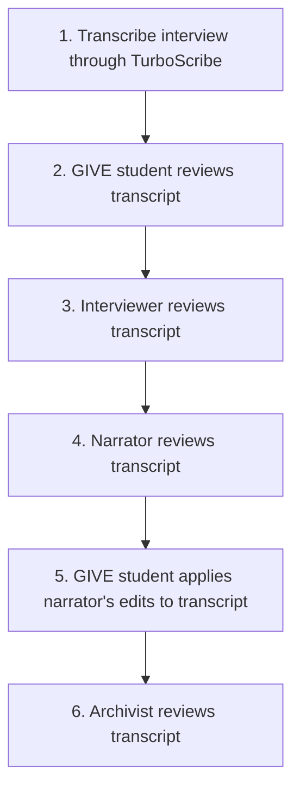

# Understanding the transcript review process for NeTIA
Return to home page | Continue to procedures
<!-- Haven't coded this to work, but I will eventually -->
## Abbreviations
Throughout this documentation, the following abbreviations will be used:
  
* `GIVE`: Grantwriting In Valued Environments
* `NeTIA`: Northeast Towson Improvement Association
* `HET`: Historic East Towson
## Goal of the oral history project
HET is the oldest historic African-American community in Baltimore County, Maryland. The community's history connects to those once enslaved at the Hampton Plantation (often referred to as the Hampton Mansion). East Towson's residents often think about how their community used to be versus how it is now after years of encroachment. Despite countless attempts to erase their historical and physical presence, the community still stands. As a way to keep the history of the community alive and combat ongoing attempts of erasure, Nancy Goldring (President of NeTIA), spearheaded an Oral History and Digital Archive Project which officially began during the summer of 2025.
## Transcript review process
Every transcript that is part of NeTIA's Oral History Project goes through the same streamlined review process. This process is meant to ensure each transcript:
* Has the consent of the narrator to be part of the project
* Accurately reflects the narrator's words
* Is correct in the spelling of names and locations
* Only reflects parts of the interview that the narrator is comfortable with
  
The transcript review process operates as follows:

The diagram reflects a review process that has been applied to 25+ oral history transcripts. 

<!-- Plan on adding more about GIVE's in keeping the project moving forward -->

<!-- Plan on adding sources. All information was shared with me verbally from archivists rather than a source text. -->