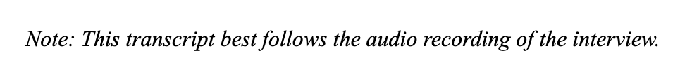
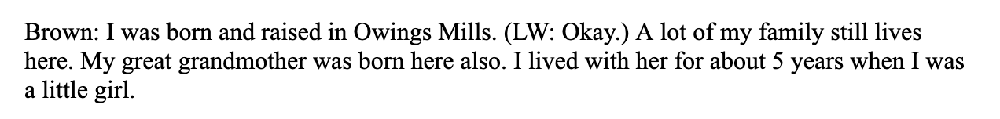
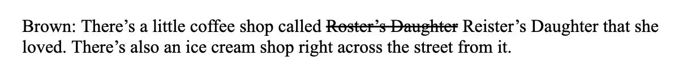

# How to review an oral history transcript
[Go back to overview](overview.md) | [Continue to troubleshooting](troubleshooting.md)

## What you will need before you start
Before you begin reviewing an oral history transcript, make sure you have access to the following:
1. Video footage of the interview
2. Audio recording of the interview
3. Oral history transcript metadata sheet
  
> **Note:** All materials listed can be accessed in the Google Drive folder labelled `HET Drive`. 
## Procedure
Follow the steps below when reviewing any transcript for NeTIA's Oral History Project:
1. **Open the HET Drive:** All oral history materials can be found in [this folder](https://docs.google.com/document/d/1qwaWklws4RVO1BmUbCCJMztSOvKA69muSgeC1wFi8fk/edit?usp=sharing) on Google Drive.

2. **Locate raw version of transcript:** All transcripts in the `HET Drive` can be found in the `Transcriptions` folder. To ensure you have found the correct version, the file name should include the narrator's full name and end with "Raw." For example, if you were looking for the raw version of Lucy Brown's transcript, the file would be labelled as `Transcription_Brown, Lucy_11.14.2025_Raw`.

3. **Create a new copy of the document:** Make sure to create a copy of the transcript's raw version. You can do this by right clicking the file and select "Duplicate." When renaming this new file, only change the last portion of the title to say "Transcriber Reviewed." For example, a copy of Lucy Brown's transcript would be renamed to `Transcript_Brown, Lucy_11.14.2025_TranscriberReviewed`.

4. **Open new copy of transcript:** Open the new "Transcriber Reviewed" version of the transcript. The document should be a Google Doc.

5. **Create a cover page:** If you do not notice a cover page in the document, one should be added now. Do not create headers or footers. On your keyboard, click the "tab" key (for Mac users) or the "enter" key (for PC users) until you see a completely blank first page. Then, add the following text to the top, center, and bottom lines:
   * **Top text:** NETIA's ORAL HISTORY AND DIGITAL ARCHIVE PROJECT
   * **Center text:** [Narrator's first and last name] interviewed by [interviewer's first and last name]
   * **Bottom text:** Northeast Towson Improvement Association + [Date of interview]

6. **Determine if transcript follows video or audio recording:** The begining of the document should note whether the transcript was created using the interview video or audio. Use this to determine whether you will listen to the video or audio as you go through the transcript. If there is no note in the document, default to the interview video.

7. **Begin playing interview video or audio:** As you review the transcript, make sure you use the interview video or audio to gauge what edits need to be made.

8. **Begin making edits in the document:** There is no exact order to making edits in a transcript. Make edits as they come. However, there are protocols for specific editing scenarios. Keep the "Style Guide" section below handy to see protocols regarding formatting and transcribing things like overlapped speaking or laughter. As you listen to the interview and begin making edits, consider the following:
    * Spelling of names, streets, and places
    * Overlapped speaking
    * Inaccurately transcribed words or phrases
    * Audible sounds or noises from narrator, interviewer, or interview environment

> **Note:** If any questions or concerns arise throughout the review process, please refer to the [troubleshooting](troubleshooting.md) page.
## Style guide
Use this style guide when reviewing all transcripts for NeTIA's Oral History Project.
  
  ### Font and spacing
  Use Times New Roman 12-point font with single spacing (including the cover page).
### Labeling speakers
When a speaker is speaking for the first time, use their full name. The second and following times they speak, only use thier last name.

### Filler words
If you notice an interviewer or narrator saying "um" or "uh," you do not need to reflect that in the transcript. Leave the sentence without the filler words. Only note pauses using tags (see below).

### Transcribing short interjections
Often times, you will hear short interjections from the interviewer throughout the interviewer like "okay" or "wow!" To signify these interjections, use parentheses with the speaker's initials and what they said inside them. For example, if an interviewer named Laura Winters interjected by saying "okay" when a narrator was speaking, you would write: `(LW: Okay.)` However, if the interjection was substantial (more than three words) do not change the formatting.

### Correcting spelling mistakes or phrases
If you notice a word or phrase was transcribed inaccurately or spelled incorrectly, strike through the inaccurate text and add in the accurate text or correct spelling next to it.

### Incorporating tags
Make sure to utilize tags! Tags can be used to signal nonverbal communciation like body movement, verbal noises like laughter, but also uncertainies like the spelling of a name. These tags help create transcripts that are all-encompassing of what is happening in the room where the interview is taking place.
  
Make sure you add in the tag `[END OF INTERVIEW]` to the end of every transcript. Other tags are dependent on each narrator, interviewer, and environment the interview is taking place in. Here is a list of tags that can be used:
| Tag | Occasion for use |
| --- | --- |
| `[END OF INTERVIEW]` | This tag indicates that the interview is complete. Must be inserted at the end of every transcript.
| `[INTERUPTION]` | This tag indicates that the interview was interuppted in some way. For example, the narrator recieves a phone call in the middle of the interview.
| `[PHONETIC]` | This tag indicates that the name of a person, street, or place is spelled how it sounds which may not be accurate. Often used when the reviewer is not sure about the accurate spelling of someone's name who is mentioned.
| `[LAUGHS]` | This tag indicates that the speaker is laughing.
| `[PAUSES]` | This tag indicates that the speaker has stopped talking for a significant amount of time (usually 3 seconds or longer).
| `[POINTS]` | This tag indicates that the speaker is pointing to something in the physical space of the interview.
| `[GESTURES WITH HANDS]` | This tag indicates that the speaker is moving their hands in manner that emphasizes what they are saying.

## Example Transcript
As a reference, please utilize this transcript that has been transcriber reviewed: https://docs.google.com/document/d/1YEfD1aQSi_R1OOW454bykOWC6GhanaWz/edit?usp=sharing&ouid=108318833453586660421&rtpof=true&sd=true